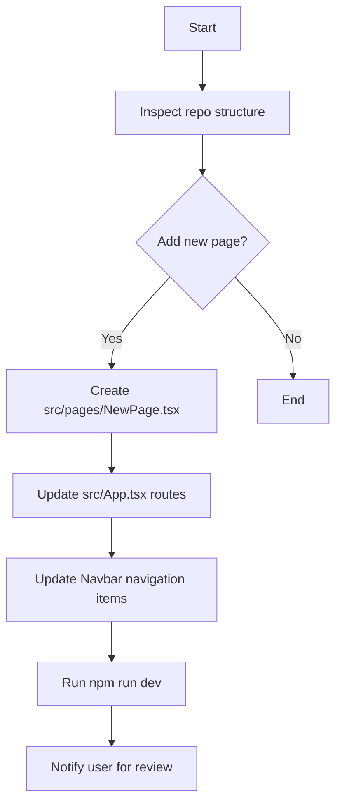

# Agents Documentation

**Purpose**: This file provides guidance for AI‑assisted development tools (agents, code‑assistants, IDE extensions) on how to interact with the **Nookanomics** repository.

## Project Overview
- A premium, Animal Crossing‑themed single‑page application built with **Vite**, **React**, **TypeScript**, and **Tailwind CSS**.
- Core pages: `Home`, `Directory`, `Videos`, and `Merchandise`.
- Uses **React Router** for navigation, **Framer Motion** for smooth animations, and **Lucide React** for icons.

## Repository Structure (relevant for agents)
```
src/
├─ assets/          # static images, fonts, icons
├─ components/      # reusable UI components
│   ├─ layout/      # Navbar, Layout wrapper
│   └─ ...
├─ pages/           # page components (Home, Directory, Videos, Merchandise)
├─ styles/          # Tailwind config, global CSS
├─ App.tsx          # routing configuration
└─ main.tsx         # React entry point
```

## Common Agent Tasks
- **File Generation**: Use `write_to_file` to create new components under `src/components/` or pages under `src/pages/`.
- **Routing Updates**: When adding a new page, update `src/App.tsx` to include a `<Route>` and ensure the navigation bar (`src/components/layout/Navbar.tsx`) lists the new route.
- **Styling**: Extend Tailwind utilities in `tailwind.config.js` for custom colors or animations.
- **Testing**: Run `npm run build` to verify compilation, or `npm test` if a test suite is added.
- **Documentation**: Keep `README.md`, `CONTRIBUTIONS.md`, and this `AGENTS.md` up‑to‑date.

## Agent Interaction Guidelines
1. **Read‑Only Operations**: Use `view_file` or `view_file_outline` to inspect existing code before making changes.
2. **Modifications**: Prefer `replace_file_content` for single‑block edits; use `multi_replace_file_content` for non‑contiguous updates.
3. **Task Management**: When performing multi‑step work, wrap the sequence with `task_boundary` to keep progress visible.
4. **User Confirmation**: After generating or modifying files, call `notify_user` with a concise summary and request review if the change is non‑trivial.
5. **Safety**: Avoid destructive commands (e.g., `rm -rf`) unless explicitly approved.

## Example Agent Workflow


---
*Agents should treat this repository as a living codebase: always verify the current state before applying changes and keep documentation synchronized.*
